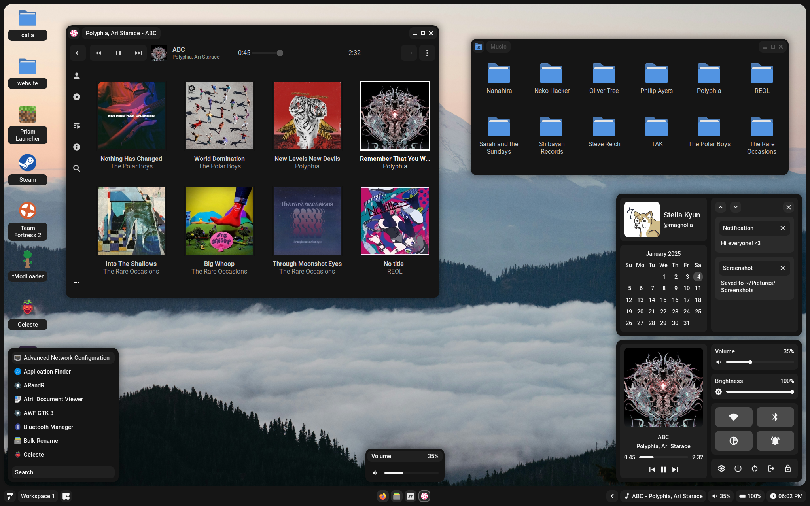

# Calla

Calla (made by [Stardust-kyun](https://github.com/stardust-kyun)) is the custom desktop enviroment for Vertex Linux, it can be installed on other arch linux baised things but is primaraly used on Vertex Linux.
## Screenshots 

## Dependencies

- `xorg-server`
- `pipewire-pulse`
- `brightnessctl`
- `inotify-tools`
- `awesome-git`
- `picom`
- `maim`
- `papirus-icon-theme`
- `noto-fonts`
- `noto-fonts-cjk`
- `noto-color-emoji-fontconfig`
- `noto-fonts-extra`
- `lua-pam-git`
- `playerctl`
- `xclip`

### Optional

- `st`: Terminal emulator
- `vim-gtk3`: Vim with clipboard support
- `nemo`: File manager
- `network-manager-gnome`: Network applet
- `polkit-gnome`: Polkit authentication agent
- `cbatticon`: Battery status applet
- `blueman`: Bluetooth manager
- `xdg-user-dirs`: Generates standard home directories
- `arandr + xrandr`: Dislpay manager, used in settings

---

# TODO

---

### Credits

- [Stardust-kyun](https://github.com/Stardust-kyun) the original creator of the DE
- [Ardox](https://github.com/LeVraiArdox) for refactoring and adding proper packaging for Arch.
- [Sammy](https://github.com/TorchedSammy) for help understanding and adding live reloading.
- [Crylia](https://github.com/Crylia) for massive amounts of help learning awesomewm.
- [Jimmy](https://github.com/Jimmysit0) and [Petrolblue](https://github.com/petrolblue) for help with color schemes and lots of support.
- And the support of many more!

